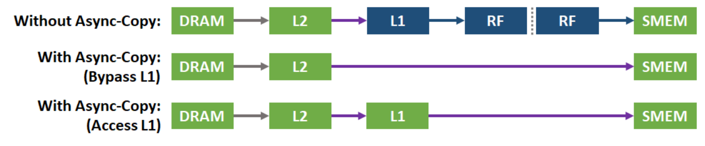

# GEMM MMA

GEMM MMA 构建了一个初级的GEMM kernel， 它使用CUDA `mma.sync`指令来使用GPU tensor core单元，并对比了和cutlass算子的性能，本例主要为了介绍使用 `mma.sync` 构建一个完整的GEMM kernel，性能还有很大的优化空间。

ldgsts 分支主要来介绍使用Ampere引入的异步拷贝来优化性能

## 总体思路


 

上图展示了GEMM MMA的计算流程，蓝色部分代表1个block要计算的部分，蓝色部分下的每个小方块代表每个warp的计算部分，右侧青色部分代表每个warp的计算部分，青色部分下的每个小方块代表tensor core支持的分块大小，在调用tensor core之前，加载一个绿色方块和红色方块进入共享内存，之后每个warp独立同步地调用`mma.sync` 来计算每个分块的结果，其中 $M'$ $N'$ $K'$ 代表tensor core单元支持计算的GEMM维度。

## 异步拷贝

CUDA 11 includes a new asynchronous copy (async copy) API to take advantage of the A100 
GPU’s hardware-accelerated direct-copy-to-shared functionality. Async copy performs an 
asynchronous (non-blocking) direct memory transfer from global memory to shared memory, 
bypassing the SM threads and combining the functions of separate “load from global memory 
into a register”, and “write to shared memory from a register” operations into a single, efficient 
operation. 

Async copy eliminates the need for intermediate staging of data through the register file (RF), 
reducing register file bandwidth. It also efficiently uses memory bandwidth and reduces power 
consumption. As the name implies, async copy works asynchronously, allowing other 
computations to occur during global-to-shared memory copies. Async copy is able to notify the 
program of copy completion via the GPU’s new barrier feature.

Bypassing L1 and the register file can significantly accelerate memory copy performance, 
especially for multiple successive async-copy operations that copy large amounts of data from 
global to shared memory. 



Two variants of the async copy instruction are available for different usage scenarios. BYPASS, 
which bypasses L1 cache and the register file as described above, and ACCESS which saves 
data to L1 for subsequent accesses and reuse. 

### cu level

```
asm volatile("cp.async.cg.shared.global [%0], [%1], %2;\n"
                :: "r"((uint32_t)__cvta_generic_to_shared(&C[tileIdx])),
                "l"(&arg.C[rowC_0*arg.problem_size.n()+colC_0]),
                "n"(16)
            );
```

### ptx level

```
cp.async.cg.shared.global [%r158], [%rd18], 16;
```

### SASS level

```
LDGSTS.E.BYPASS.128 [R7+0x1800], [R4.64] ;
```


## 结果

```
[        problem size] (8192,8192,8192)
[          cutlassMMA] Runtime: 15.938765(ms) Gflops: 68983.491336
[            MMA_base] Runtime: 315.683228(ms) Gflops: 3482.958649
[       MMA_base==ref] PASS
[            MMA_ldgsts] Runtime: 297.315948(ms) Gflops: 3698.125289
[       MMA_ldgsts==ref] PASS
```


