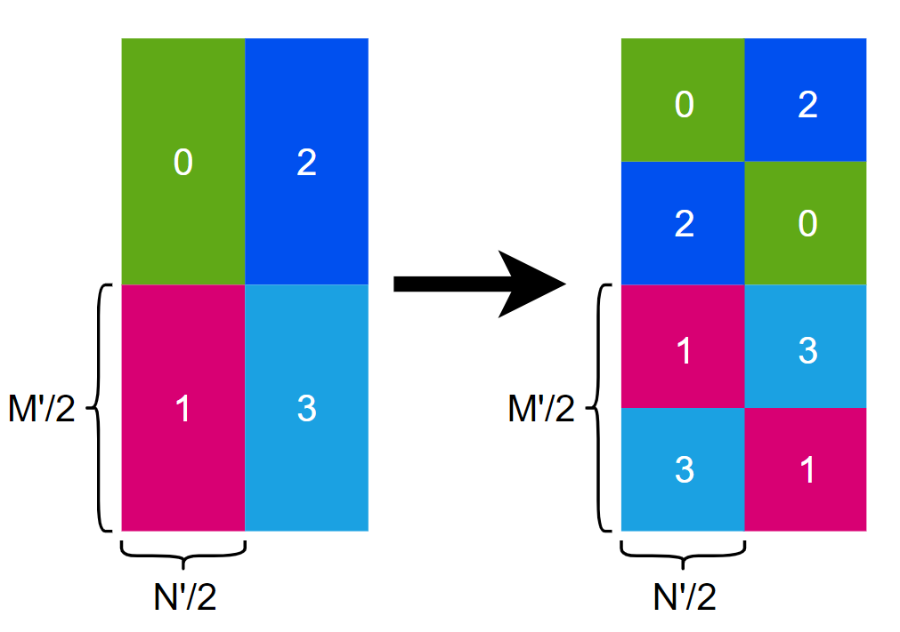
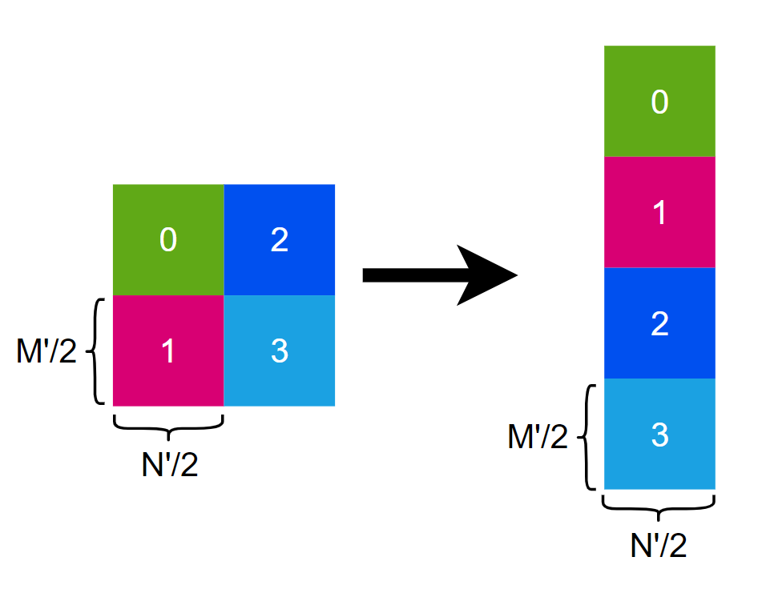
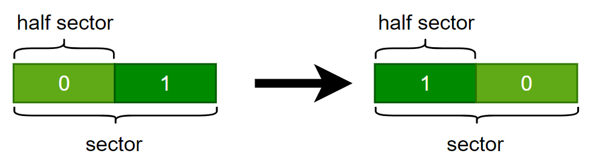
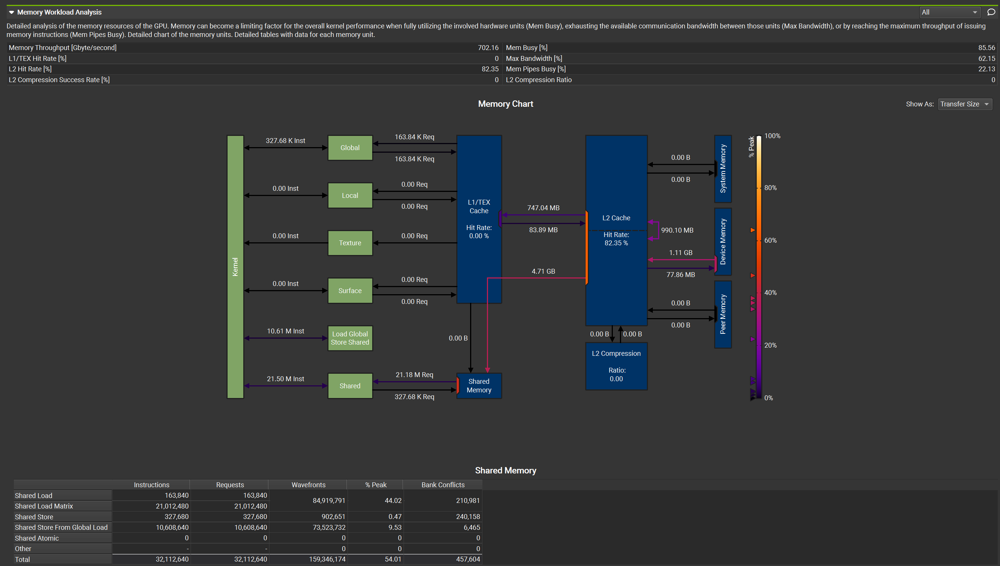

# GEMM MMA

GEMM MMA 构建了一个初级的GEMM kernel， 它使用CUDA `mma.sync`指令来使用GPU tensor core单元，并对比了和cutlass算子的性能，本例主要为了介绍使用 `mma.sync` 构建一个完整的GEMM kernel，性能还有很大的优化空间。

ldmatrix 分支尝试使用`ldmatrix`指令来加载共享内存

## 总体思路


上图展示了GEMM MMA的计算流程，蓝色部分代表1个block要计算的部分，蓝色部分下的每个小方块代表每个warp的计算部分，右侧青色部分代表每个warp的计算部分，青色部分下的每个小方块代表tensor core支持的分块大小，在调用tensor core之前，加载一个绿色方块和红色方块进入共享内存，之后每个warp独立同步地调用`mma.sync` 来计算每个分块的结果，其中 $M'$ $N'$ $K'$ 代表tensor core单元支持计算的GEMM维度。

## ldmatrix

`ldmatrix.sync` 指令是 Warp-level matrix load instruction，它是 `mma.sync` 对应的load共享内存的指令

## 解决shared memory bank冲突

之前没有注意到shared memory 存在 bank 冲突 ，所以通过调整 shared memory 布局来解决 bank 冲突问题



上图中 0,1,2,3 分别代表每个 warp 一次加载的 shared memory 部分, 加载的部分为 A 矩阵(行主序)

## 访存合并

在解决 shared memory bank 冲突时，如果做如下调整会导致 global memory 访存无法合并



因为 `N'=8` ， 所以一行正好是 32bytes，即一个sector，而如果一个sector被拆开放到 shared memory 中去会导致访存无法合并，而下图中的变换是可以合并访存的



## Nsight Compute

Nsight Compute(ncu) 是 NVIDIA 推出的对 kernel profile 工具，之前一直用的命令行方式，最近发现 ncu-ui 输出的信息更完善丰富，比如下图可以对访存进行细致的展示



## 结果

```
[        problem size] (8192,8192,8192)
[          cutlassMMA] Runtime: 12.476519(ms) Gflops: 88126.476648
[            MMA_tune] Runtime: 16.939159(ms) Gflops: 64909.456381
[       MMA_tune==ref] PASS
```
