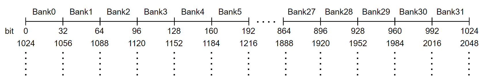

# GEMM MMA

GEMM MMA 构建了一个初级的GEMM kernel， 它使用CUDA `mma.sync`指令来使用GPU tensor core单元，并对比了和cutlass算子的性能，本例主要为了介绍使用 `mma.sync` 构建一个完整的GEMM kernel，性能还有很大的优化空间。

bfco分支主要介绍如何通过解决shared memory bank conflict 和 memory coalesce (访存合并) 来优化性能。

bf 代表 bank free , co 代表 coalesce 

## 总体思路


 

上图展示了GEMM MMA的计算流程，蓝色部分代表1个block要计算的部分，蓝色部分下的每个小方块代表每个warp的计算部分，右侧青色部分代表每个warp的计算部分，青色部分下的每个小方块代表tensor core支持的分块大小，在调用tensor core之前，加载一个绿色方块和红色方块进入共享内存，之后每个warp独立同步地调用`mma.sync` 来计算每个分块的结果，其中 $M'$ $N'$ $K'$ 代表tensor core单元支持计算的GEMM维度。


## Shared memory bank

[参考cuda programming guide](https://docs.nvidia.cn/cuda/cuda-c-programming-guide/index.html#shared-memory-5-x)



要注意连续的bank存储连续的字(32-bits)，这里字的大小为32 bits，总共有32个bank

要想解决bank conflict问题，要将一个warp内线程读取的shared memory尽量分散到不同的bank里

## memory coalesce（访存合并）

访存合并用一句话来简单概括就是一个warp内线程读取的global memory尽量是连续的且128字节对齐

为什么是128字节对齐而不是其他数字？我的理解是cache line的大小是128字节，这样一个warp内的访存可以合并成以cache line为基本单位的memory transaction

## 代码分析

为了解决bank conflict 和 memory coalesce，对代码做的主要修改为变量 `tileidx`

```cpp
// in function loadtileC
int tileIdx = threadIdx.x*64 + i*4; // base
int tileIdx = threadIdx.x*64 + (i+threadIdx.x/1)%16*4; // bank free
int tileIdx = threadIdx.x*4 + i*blockDim.x*4; // memory coalesce + bank free
```

## 结果

```
[        problem size] (8192,8192,8192)
[          cutlassMMA] Runtime: 15.788442(ms) Gflops: 69640.288231
[            MMA_base] Runtime: 333.625763(ms) Gflops: 3295.643652
[       MMA_base==ref] PASS
[              MMA_bf] Runtime: 326.514526(ms) Gflops: 3367.420249
[         MMA_bf==ref] PASS
[           MMA_bf_co] Runtime: 315.669495(ms) Gflops: 3483.110172
[      MMA_bf_co==ref] PASS
```


