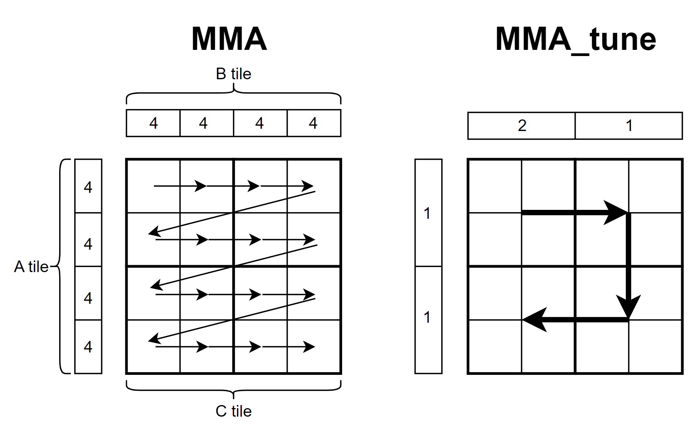

# GEMM MMA

GEMM MMA 构建了一个初级的GEMM kernel， 它使用CUDA `mma.sync`指令来使用GPU tensor core单元，并对比了和cutlass算子的性能，本例主要为了介绍使用 `mma.sync` 构建一个完整的GEMM kernel，性能还有很大的优化空间。

ptxas 分支分享一个调优过程中发现的关于ptxas(ptx汇编器)有意思的东西

## 总体思路


上图展示了GEMM MMA的计算流程，蓝色部分代表1个block要计算的部分，蓝色部分下的每个小方块代表每个warp的计算部分，右侧青色部分代表每个warp的计算部分，青色部分下的每个小方块代表tensor core支持的分块大小，在调用tensor core之前，加载一个绿色方块和红色方块进入共享内存，之后每个warp独立同步地调用`mma.sync` 来计算每个分块的结果，其中 $M'$ $N'$ $K'$ 代表tensor core单元支持计算的GEMM维度。

## 事情起因

在优化kernel过程中，发现每个warp循环计算每个Ctile时，都需要从共享内存加载Atile和Btile一次，这样Atile和Btile会被重复加载4次，那其实这里数据是可以复用的，而不用多次加载，于是重新设计了下每个warp计算流程，将4x4tile划分为4个2x2的大tile，每次计算大tile前先把对应的Atile和Btile从共享内存加载到寄存器中，在计算下一个大tile时只需要重新加载一个 A/B tile即可(例如从左上角移动到右上角只需要重新加载Btile即可，Atile是可以复用的)，下图为优化前后的计算流程图，其中C tile为每个warp需要计算的矩阵C的部分，图上的数字代表数据块被加载的次数



然而就在我把代码写好，验证通过后，惊讶地发现两个kernel的运行时间很接近，通过ncu profile后发现运行的指令数竟然是一样的，反汇编后发现两个kernel的sass指令数竟然是相同的，然后仔细看了下，代码逻辑完全是一模一样的，只是部分寄存器命名不一样，这有点离谱，然后看了下两个kernel的ptx指令逻辑还是不一样的，难道CUDA的ptxas优化的这么离谱。

这里给出kernel的ptx和sass指令

两个kernel的ptx版本分别为 [ptx_mma](ptx/ptx_mma) 和 [ptx_mma_tune](ptx/ptx_mma_tune)

两个kernel的sass版本分别为 [sass_mma](sass/sass_mma) 和 [sass_mma_tune](sass/sass_mma_tune)

## 杂项

优化了半天最后发现机器码都是一样的，确实感觉到了编译器的强大，关键是怎么知道代码哪些是已经被编译器优化好了呢。

另外意外发现了A100 80GB 相比A100 40GB 可以提升33%左右的性能，于是感觉很奇怪，这两个版本不就是显存大小不一样嘛，怎么运行速度差距这么大，于是发现A100 80GB显存带宽 2TB/s，而40BG版本显存带宽 1.5TB/s，这相当于显存带宽提升了33%，这难道全部转化成性能提升了吗？

```
A100 40GB
[        problem size] (5120,4096,4096)
[          cutlassMMA] Runtime: 2.370118(ms) Gflops: 72485.278929
[            MMA_base] Runtime: 6.451385(ms) Gflops: 26629.735875
[       MMA_base==ref] PASS
[            MMA_tune] Runtime: 6.456460(ms) Gflops: 26608.804078
[       MMA_tune==ref] PASS

A100 80GB
[        problem size] (5120,4096,4096)
[          cutlassMMA] Runtime: 1.781453(ms) Gflops: 96437.410102
[            MMA_base] Runtime: 4.881101(ms) Gflops: 35196.711561
[       MMA_base==ref] PASS
[            MMA_tune] Runtime: 4.883047(ms) Gflops: 35182.685107
[       MMA_tune==ref] PASS
```