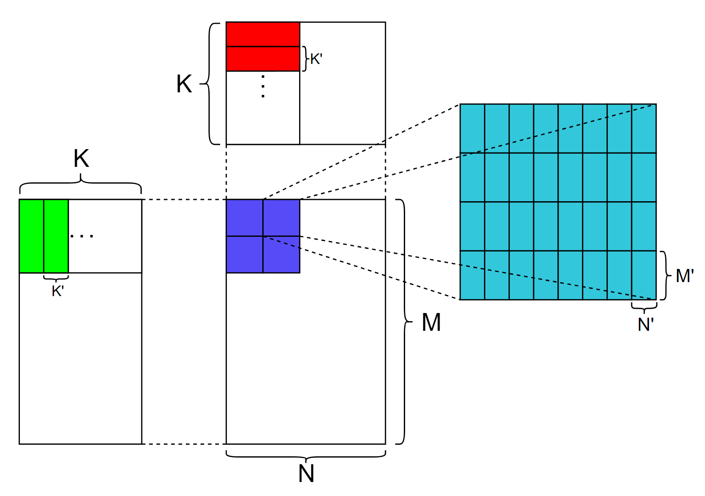

# GEMM MMA

GEMM MMA 构建了一个初级的GEMM kernel， 它使用CUDA `mma.sync`指令来使用GPU tensor core单元，并对比了和cutlass算子的性能，本例主要为了介绍使用 `mma.sync` 构建一个完整的GEMM kernel，性能还有很大的优化空间。

vector分支主要介绍向量化load/store

## 总体思路


 

上图展示了GEMM MMA的计算流程，蓝色部分代表1个block要计算的部分，蓝色部分下的每个小方块代表每个warp的计算部分，右侧青色部分代表每个warp的计算部分，青色部分下的每个小方块代表tensor core支持的分块大小，在调用tensor core之前，加载一个绿色方块和红色方块进入共享内存，之后每个warp独立同步地调用`mma.sync` 来计算每个分块的结果，其中 $M'$ $N'$ $K'$ 代表tensor core单元支持计算的GEMM维度。


## 向量化

向量化在不同层级的表现

### cu level

```
*reinterpret_cast<float4*>(&A[tileIdx]) = *reinterpret_cast<float4*>(&arg.A[rowA_0*arg.problem_size.k()+colA_0]);
```

### ptx level

```
ld.global.v4.u32 {%r161, %r162, %r163, %r164}, [%rd5];
st.shared.v4.u32 [%r16], {%r161, %r162, %r163, %r164};
```

### SASS level

```
LDG.E.128 R8, [R10.64] ;
STS.128 [R17], R8 ;
```

## 结果

```
[        problem size] (8192,8192,8192)
[          cutlassMMA] Runtime: 15.816908(ms) Gflops: 69514.954246
[            MMA_base] Runtime: 460.150970(ms) Gflops: 2389.458457
[       MMA_base==ref] PASS
[             MMA_vec] Runtime: 333.618652(ms) Gflops: 3295.713894
[        MMA_vec==ref] PASS
```


