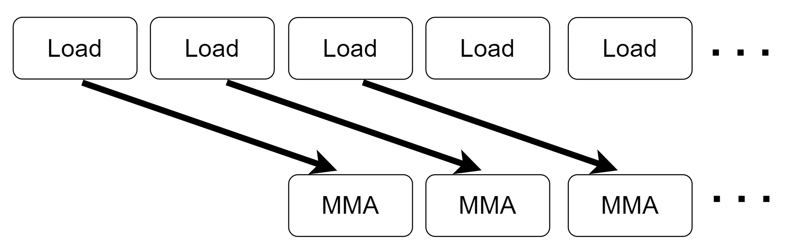

# GEMM MMA

GEMM MMA 构建了一个初级的GEMM kernel， 它使用CUDA `mma.sync`指令来使用GPU tensor core单元，并对比了和cutlass算子的性能，本例主要为了介绍使用 `mma.sync` 构建一个完整的GEMM kernel，性能还有很大的优化空间。

prefetchx 分支和之前的prefetch分支类似，区别是增加了预取数据大小并利用了同步指令`cp.async.waitgroup N`

## 总体思路


上图展示了GEMM MMA的计算流程，蓝色部分代表1个block要计算的部分，蓝色部分下的每个小方块代表每个warp的计算部分，右侧青色部分代表每个warp的计算部分，青色部分下的每个小方块代表tensor core支持的分块大小，在调用tensor core之前，加载一个绿色方块和红色方块进入共享内存，之后每个warp独立同步地调用`mma.sync` 来计算每个分块的结果，其中 $M'$ $N'$ $K'$ 代表tensor core单元支持计算的GEMM维度。


## 数据预取

数据预取在之前介绍过，本次优化主要将预取数据的大小增加了1倍，并且显式地调用同步指令`cp.async.waitgroup N`来确保数据已经拷贝完成，主要流程如下图片



## 结果

> PS: 这次测试结果使用的是A100 80GB版本

```
[        problem size] (8192,8192,8192)
[          cutlassMMA] Runtime: 12.857344(ms) Gflops: 85516.235366
[            MMA_base] Runtime: 30.978357(ms) Gflops: 35492.896431
[       MMA_base==ref] PASS
[            MMA_tune] Runtime: 27.419851(ms) Gflops: 40099.109788
[       MMA_tune==ref] PASS
```
